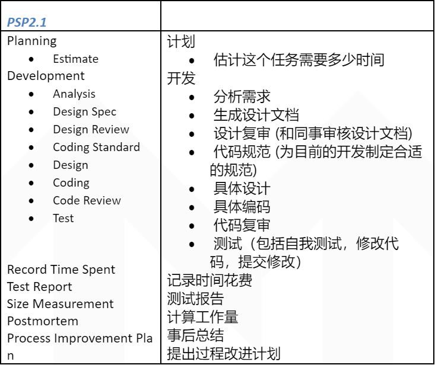

# 第一次作业

------
[TOC]

------

## 一、简单题
###软件工程的定义
**定义1：**
是指导计算机软件开发和维护的工程学科。采用工程的概念、原理、技术和方法来开发与维护软件，把经过实践考验而证明正确的管理技术和当前能够得到的最好的技术方法结合起来，这就是软件工程。
**定义2：**
(1)将系统化、规范化、可度量的方法应用与软件的开发、运行和维护的过程，即将工程化应用于软件中。
(2)对(1)中所述方法的研究。 

###解释 software crisis、COCOMO 模型。
**软件危机：**
软件危机是指在计算机软件的开发和维护过程中所遇到的一系列严重问题。
软件危机是落后的软件生产方式无法满足迅速增长的计算机软件需求,从而导致软件开发与维护过程中出现一系列严重问题的现象。这些严重的问题阻碍着软件生产的规模化、商品化以及生产效率，让软件的开发和生产成为制约软件产业发展的“瓶径”。
**COCOMO模型：**
构造性成本模型（COCOMO，英文全称为Constructive Cost Model）是由巴里·勃姆（Barry Boehm）提出的一种软件成本估算方法。这种模型使用一种基本的回归分析公式，使用从项目历史和现状中的某些特征作为参数来进行计算。
构造性成本模型由三个不断深入和详细的层次组成。第一层,"基本COCOMO",适用对软件开发进行快速、早期地对重要的方面进行粗略的成本估计，但因其缺少不同的项目属性（“成本驱动者”）的因素,所以准确性有一定的局限性。“中级COCOMO”中考虑进了这些成本驱动者。“详细COCOMO”加入了对不同软件开发阶段影响的考量。

###软件生命周期
**简介**
软件生命周期又称为软件生存周期或系统开发生命周期，是软件的产生直到报废的生命周期，周期内有问题定义、可行性分析、总体描述、系统设计、编码、调试和测试、验收与运行、维护升级到废弃等阶段，这种按时间分程的思想方法是软件工程中的一种思想原则，即按部就班、逐步推进，每个阶段都要有定义、工作、审查、形成文档以供交流或备查，以提高软件的质量。但随着新的面向对象的设计方法和技术的成熟，软件生命周期设计方法的指导意义正在逐步减少。生命周期的每一个周期都有确定的任务，并产生一定规格的文档（资料），提交给下一个周期作为继续工作的依据。按照软件的生命周期，软件的开发不再只单单强调“编码”，而是概括了软件开发的全过程。软件工程要求每一周期工作的开始只能必须是建立在前一个周期结果“正确”前提上的延续；因此，每一周期都是按“活动 ── 结果 ── 审核 ── 再活动 ── 直至结果正确”循环往复进展的。
**典型划分 GB8567**
1）软件分析时期：问题定义、可行性研究、需求分析
2）软件设计时期：总体设计、详细设计
3）编码与测试时期：编码、测试
4）运行与维护时期

###按照 SWEBok 的 KA 划分,本课程关注哪些 KA 或知识领域？
软件需求，软件设计，软件工程管理，软件工程过程，软件工程工具和方法，软件质量

###解释 CMMI 的五个级别。
1） 初始级Level 1 - Initial 
软件过程是无序的，有时甚至是混乱的，对过程几乎没有定义，成功取决于个人努力。管理是反应式的。 
2）可管理级 Level 2 - Managed 
建立了基本的项目管理过程来跟踪费用、进度和功能特性。制定了必要的过程纪律，能重复早先类似应用项目取得的成功经验。 
3） 已定义级 Level 3 - Defined 
已将软件管理和工程两方面的过程文档化、标准化，并综合成该组织的标准软件过程。所有项目均使用经批准、剪裁的标准软件过程来开发和维护软件，软件产品的生产在整个软件过程是可见的。 
4） 量化管理级Level 4 - Quantitatively Managed 
分析对软件过程和产品质量的详细度量数据，对软件过程和产品都有定量的理解与控制。管理有一个作出结论的客观依据，管理能够在定量的范围内预测性能。 
5） 优化管理级Level 5 - Optimizing 
过程的量化反馈和先进的新思想、新技术促使过程持续不断改进。

###用自己语言简述 SWEBok 或 CMMI （约200字）
CMMI是软件能力成熟度集成模型（Capability Maturity Model Integration）。其目的是帮助软件企业对软件工程过程进行管理和改进，增强开发与改进能力，从而能按时地、不超预算地开发出高质量的软件。CMMI所依据的想法是：只要集中精力持续努力去建立有效的软件工程过程的基础结构，不断进行管理的实践和过程的改进，就可以克服软件开发中的困难。

CMMI为改进一个组织的各种过程提供了一个单一的集成化框架，新的集成模型框架消除了各个模型的不一致性，减少了模型间的重复，增加透明度和理解，建立了一个自动的、可扩展的框架。因而能够从总体上改进组织的质量和效率。CMMI主要关注点就是成本效益、明确重点、过程集中和灵活性四个方面。

CMMI原先面向软件工程，但是近年已经被高度一般化，以包含其他兴趣范围，例如硬件产品的开发、所有种类的业务的交付，以及产品和服务的采购。“软件”这个词现在不出现在希迈的定义中了。这个改进概念的一般化，使得希迈极度抽象。它现在不像它的前身——软件能力成熟度模型——一样为软件工程所特有了。

##二、解释 PSP 各项指标及技能要求

记录下各阶段所用时间，然后计算百分比